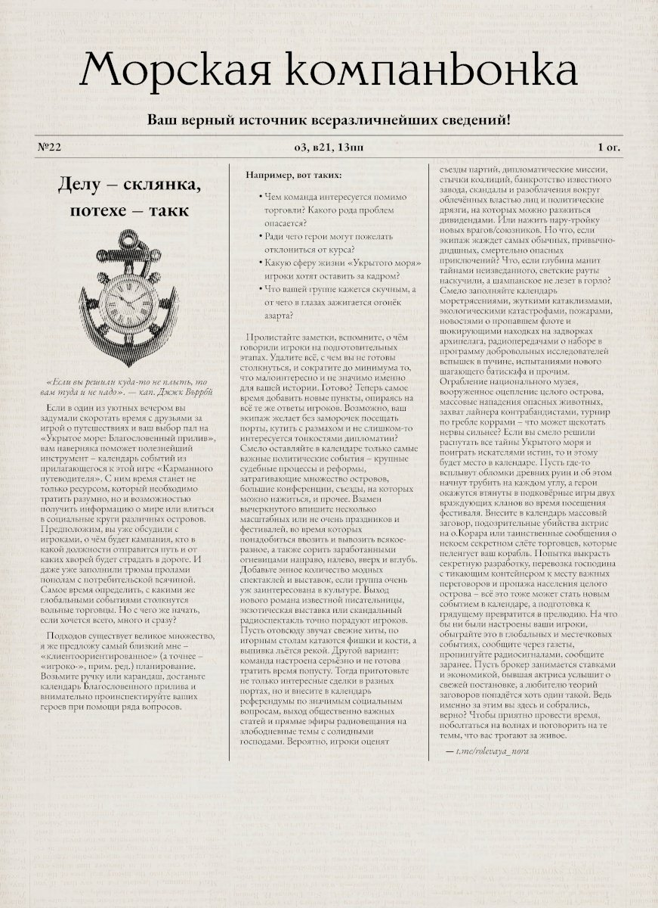

# OuW Muckraker
A vintage newspaper atricles generator for [On Ulterior Waves TTRPG](https://ukrytoemore.ru/).

Based on [Muckraker](http://muckraker.kmiziz.xyz) by [Kompoth](https://github.com/kompoth/muckraker). Just a visual redesign mostly.

## Acknowledgements
OuW Muckraker uses a long list of amazing packages, libraries and tools.
Some of them are listed in the `requirements.txt` file.

Special mentions:
- [Python-Markdown](https://github.com/Python-Markdown/markdown) - HTML generation.
- [Weasyprint](https://github.com/Kozea/WeasyPrint) - PDF generation.
- [magic.css](https://css.winterveil.net/) - web page CSS.
- [bashcorpo](https://www.deviantart.com/bashcorpo) - paper texture.
- [TT2020](https://copypaste.wtf/TT2020/docs/) - typewriter font (SIL Open Font License).
- [KJV1611](https://github.com/ctrlcctrlv/kjv1611) - blackletter font (SIL Open Font License).

## Contribution
Feel free to provide your feature requests and [bug reports here](https://github.com/anmcarrow/gazetteer/issues).